LED颜色识别软件使用说明V1.0

# 简介

LED颜色识别软件可以检测LED灯的颜色，可以将摄像头或相机拍到的LED灯颜色归类为以下9类：蓝，红，绿，黄，青，紫，白，黑或灰(LED不亮)。

检测前需要使用控制台设置相机参数，检测框参数，项目参数。以上3部分参数设置完成后，即可开始使用。

软件特点：

1. 正确设置后，检测结果稳定，环境光线对结果的影响很小；
2. 被测LED位置发生小范围偏移时有自动校准位置的功能；
3. 可同时对多个LED进行检测；(检测框数量无上限)
4. 新增检测任务时，设置简单方便，无需变动硬件设备。

控制台示例图

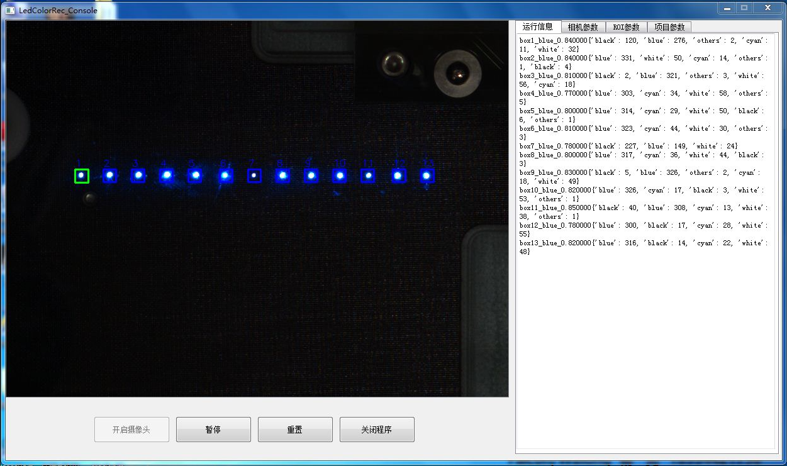

（图1）

检测过程及结果示例图

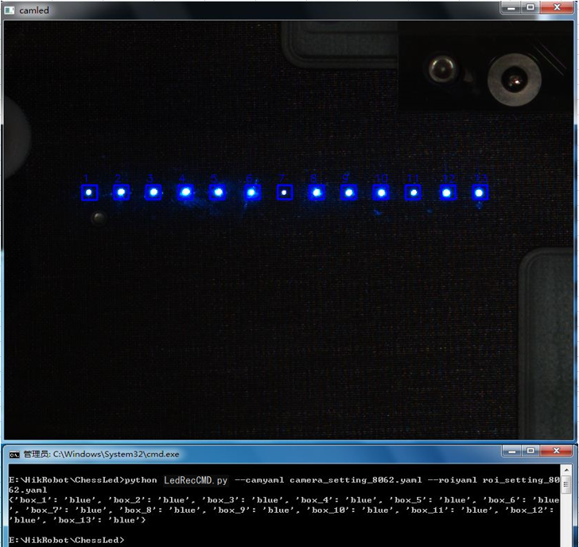

（图2）

# 应用示例

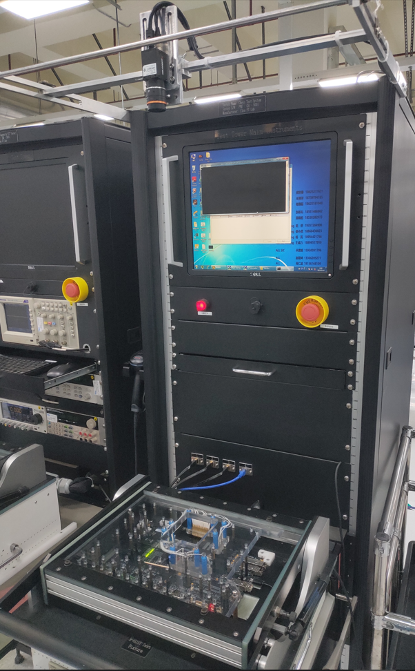

在测试站顶部安装相机，对待测PCBA板子上的LED进行颜色识别检测。

优点：一个相机即可满足多个model的LED检测需求。相机还可用于序列号二维码的读取，以及7段数码管的OCR读值。

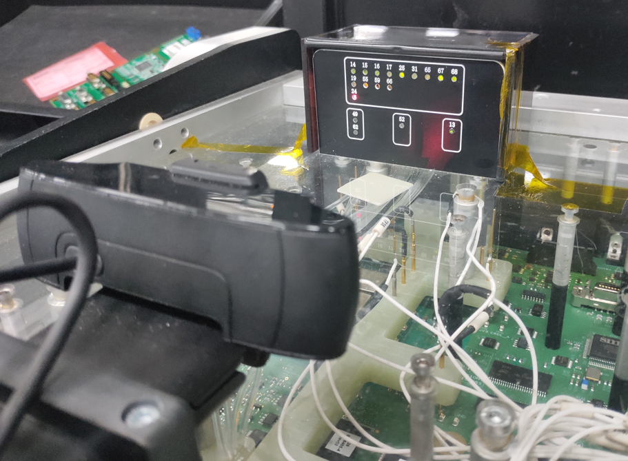

在较近的检测距离，可以直接使用USB摄像头，检测LED灯颜色。

优点：USB摄像头安装简单，成本低。

# 安装

1. 将LedRec.zip解压到本地；

文件夹内文件说明：

1. LedRecCmd.py --- 执行检测任务的程序。
2. LedRecConsole.py --- 颜色识别软件的控制台程序。
3. camera\_setting.yaml --- 默认相机参数文件。
4. roi\_setting.yaml --- 默认检测框BOX参数文件。
5. prj\_setting.yaml --- 默认项目参数文件。
6. 安装python3.8及以上版本；
7. 运行命令：pip install -r requirements.txt 安装所需python包
8. 硬件方面只需要安装摄像头或工业相机即可。由于是使用OpenCV抓取的摄像头或相机图像，所以选取工业相机时注意其对OpenCV的支持，大部分相机都是支持OpenCV的。USB摄像头最简单，插上就可以使用。

# 快速使用介绍

命令行运行： python LedRecCmd.py即可按照设定(设定方法后续介绍)开始检测，并将结果打印在命令行中，或同时生成一份.csv结果文件。

python LedRecCMD.py 参数说明：

--camyaml 后跟相机参数文件 ，默认调用camera\_setting.yaml；

--roiyaml 后跟检测框参数文件 ，默认调用roi\_setting.yaml；

--prjyaml 后跟项目参数文件，默认调用prj\_setting.yaml；

例如：对新项目8032设置并保存了三个参数文件camera\_setting\_8032.yaml, roi\_setting\_8032.yaml，prj\_setting\_8032.yaml，则在调用时可按如下方式运行即可：

python LedRecCmd.py --camyaml camera\_setting\_8032.yaml --roiyaml roi\_setting\_8032.yaml --prjyaml prj\_setting\_8032.yaml

命令行运行：python LedRecConsole.py可进入控制台，进行检测任务的设置与调试。包括对相机，检测框BOX，项目等的设置。

# 使用控制台设置参数

1. 控制台简介：

从命令行进入到”LedRecConsole.py”所在目录，执行python LedRecConsole.py 进入图3控制台界面。

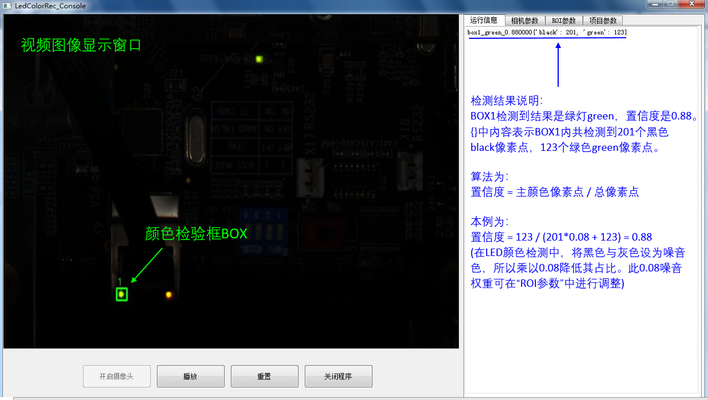

（图3）

	在摄像头或相机正常连接的情况下，点击左下角“开启摄像头”按键，开启摄像头并将摄像头拍摄画面显示在左侧的视频显示窗口中。如不能正常接入视频，请点击右上角的“相机参数”修改cam\_id的值，默认cam\_id为0。或检查摄像头是否未连接至主机。

1. 相机参数 页面说明

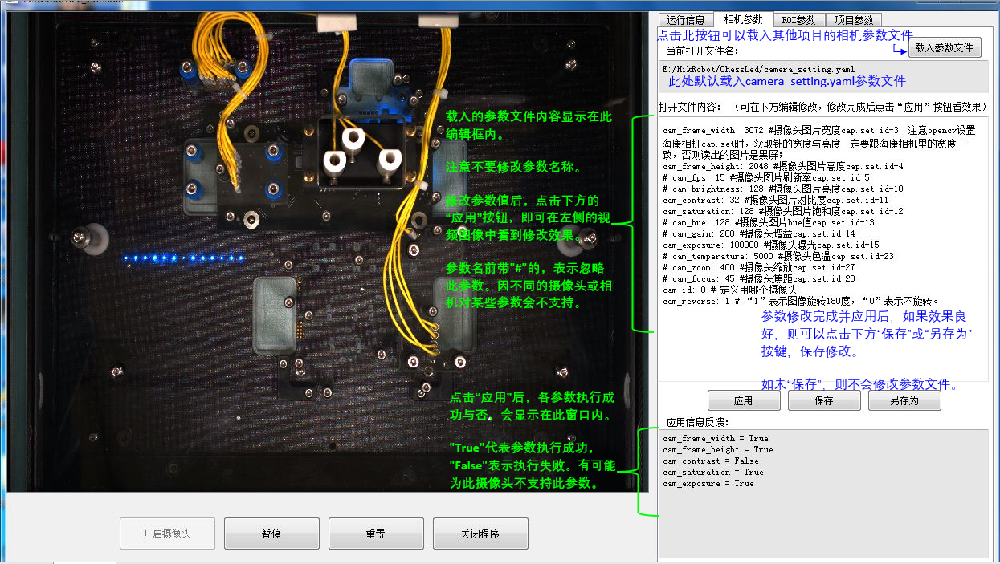

（图4）

	点击右上方的”相机参数”选项卡，进入相机参数页面。具体说明见图4标注。

	一般只需要调整明暗度，控制明暗度的参数主要有2个：cam\_brightness或cam\_exposure(曝光时长)。对自动调节明暗度的相机，使用cam\_brightness。对非自动调节的使用cam\_exposure控制明暗度。

	本例为设置了非自动调节明暗度的相机，所以使用cam\_exposure参数。

	如图4，cam\_exposure为100000时，图像较明亮，不利于LED灯光颜色的检测，所以需要将cam\_exposure降低为20000。降低后的效果如图5。

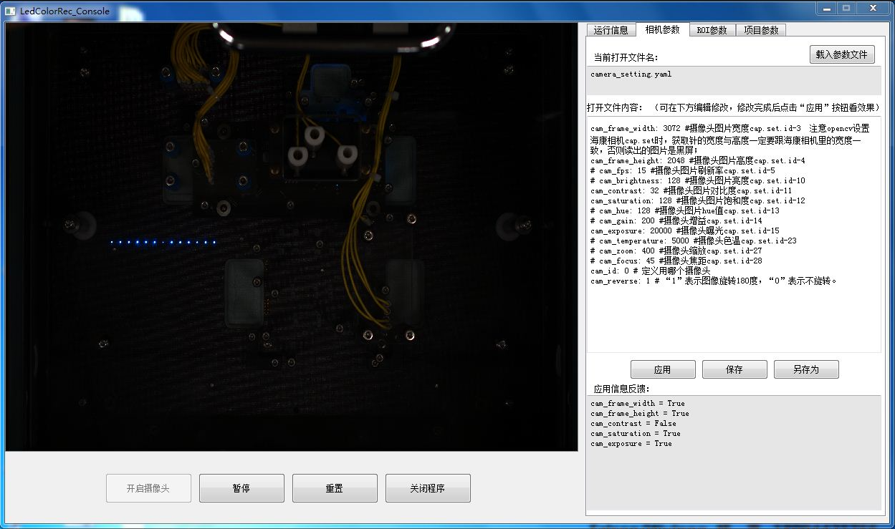

（图5）

	为避免非技术人员错改参数文件，在点击“保存”或“另存为”时，会弹出“密码确认框”，要求输入密码。如输入密码正确，则会弹出“保存成功”的提示信息。如密码错误，则不会对参数文件进行修改。之后的“BOX参数”与“项目参数”在保存与另存时，都与此相同。

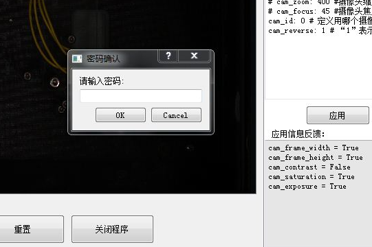	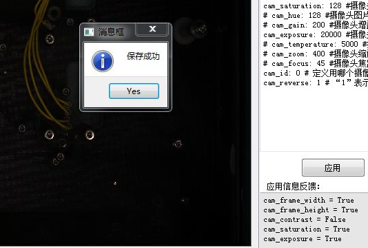

1. 检测框BOX参数(ROI参数)设置说明
	1. ROI设置

如果目标LED在视频图像上较小，可以通过划取ROI区域，局部放大目标LED所在区域的图像，便于检测框BOX的设置，操作方法如下图6所示：

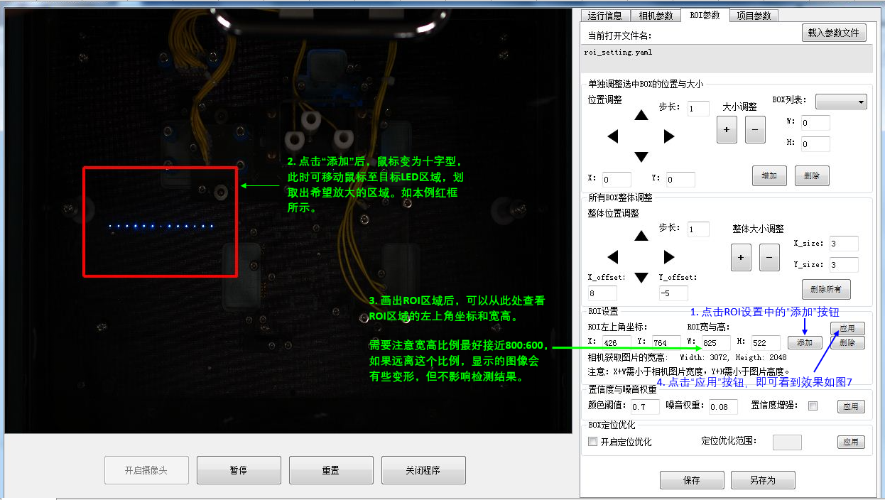

（图6）

	

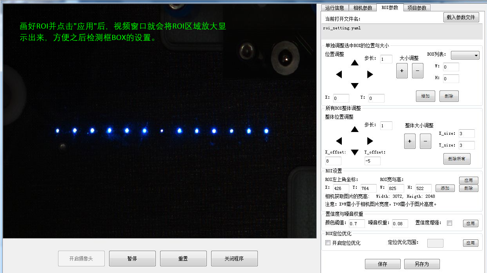

（图7）

- 
	1. 检测框BOX设置

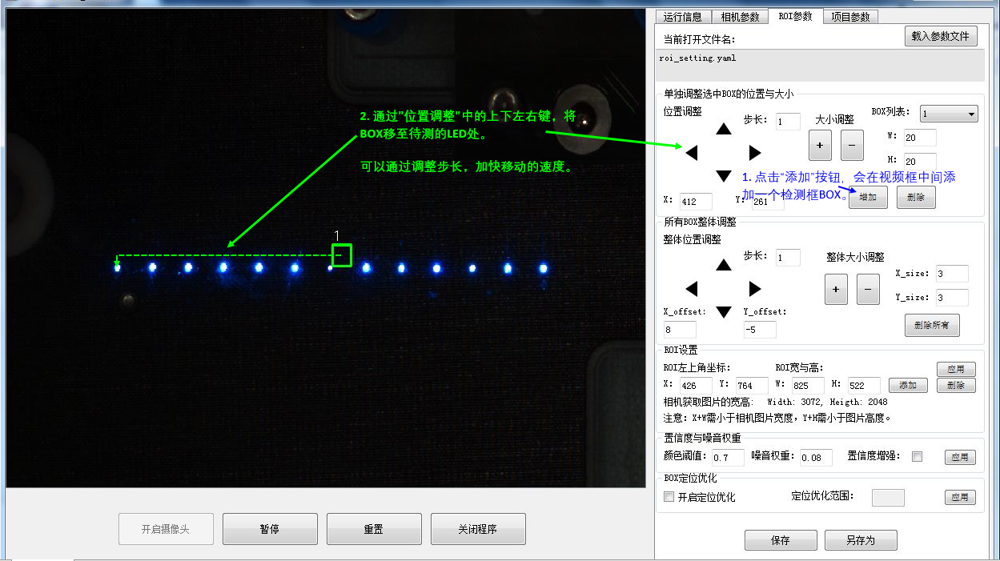

（图8）

	按照图8所示的方法，可依次添加多个BOX，如图9。

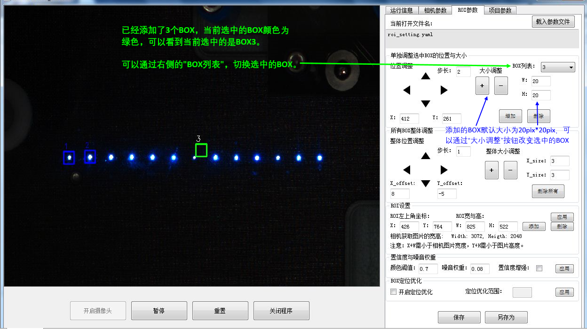

（图9）

	如果更换夹具或相机位置被改变，造成了BOX的整体偏移。可以使用BOX整体调整的功能，方便的对所有BOX位置进行调整，如图10。

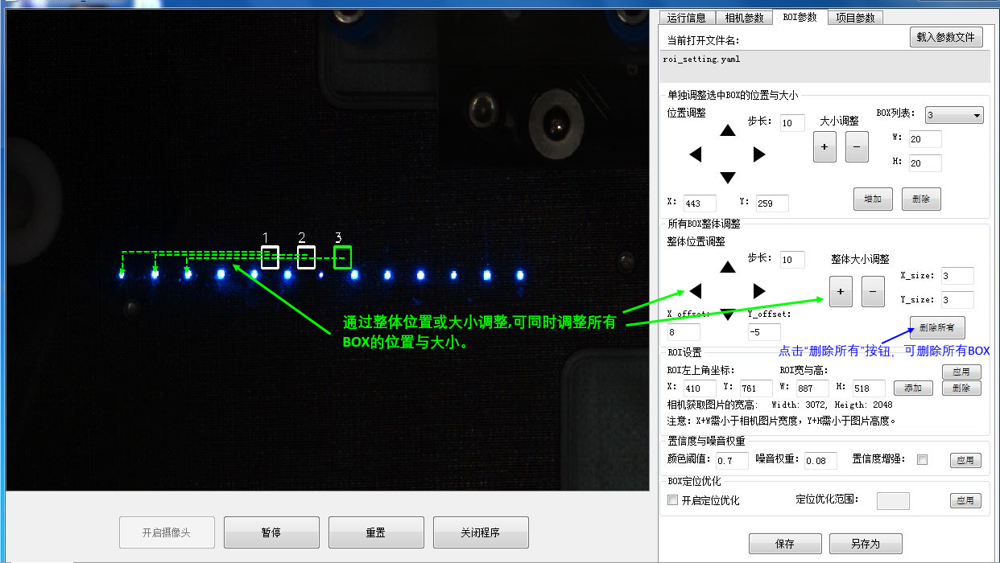

（图10）

- 
	1. 置信度与噪音权重

“ROI参数”页面中的置信度与噪音权重的设置，对于结果有较大影响。

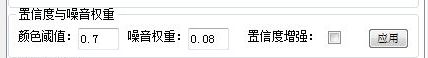

比如本例中，设置颜色阈值=0.7，噪音权重=0.08，其具体影响见图11中的说明。

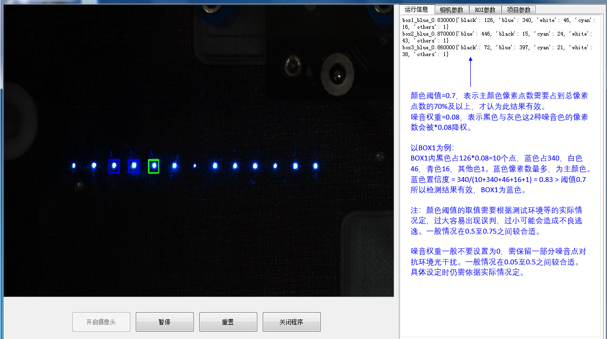

（图11）

	在实际应用中，曾遇到过LED灯光经导光管引出后，出现中心区域颜色偏白或颜色变化的情况。此时主颜色的置信度会显著下降。可通过打开“置信度增强”功能提高置信度。

	勾选“置信度增强“，置信度的计算会发生变化。

	不勾选时，如图12，置信度 = 主颜色像素数 / 总像素数

	勾选后，如图13，置信度 = （主颜色像素数 \+ 除噪音意外的颜色像素数）/ 总像素数

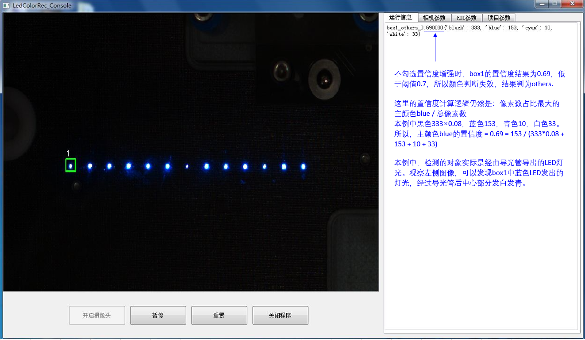

（图12）

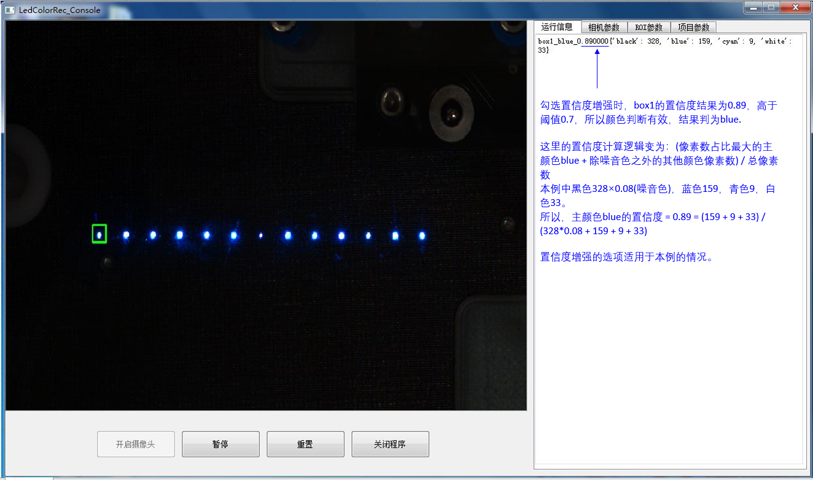

（图13）

- 
	1. BOX定位优化

BOX定位优化区域界面如下：

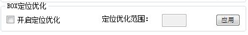

默认不开启定位优化。不开启的情况下，在调用LedRecCmd.py检测时，BOX的位置以在Console控制台中设定好的坐标为准。

在待测目标位置不会发生偏移的情况下，不必开启定位优化。但如果待测目标位置经常出现偏移，比如每次取放产品，待测LED灯的位置都会出现一些偏移时，就需要开启定位优化了。

开启定位优化后，定位优化范围输入框会变为可输入状态，此处输入的数值，代表允许在多大的范围内搜索BOX1的目标光源，并将BOX1目标光源与BOX1坐标之间的偏差，补偿到所有BOX的坐标中去。(此效果只有在调用LedRecCmd.py检测时，可以体现出来。在控制台中无法看到效果。) 具体见图14 说明。

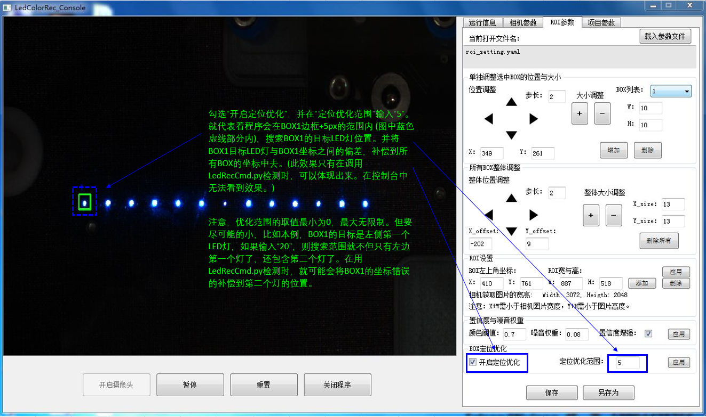

（图14）

1. 项目参数设置说明

项目参数页面如图15，本页面用于设置检测过程中的一些参数，例如：是否保存csv结果，检测结果路径，图片取样间隔，图片取样数量等。

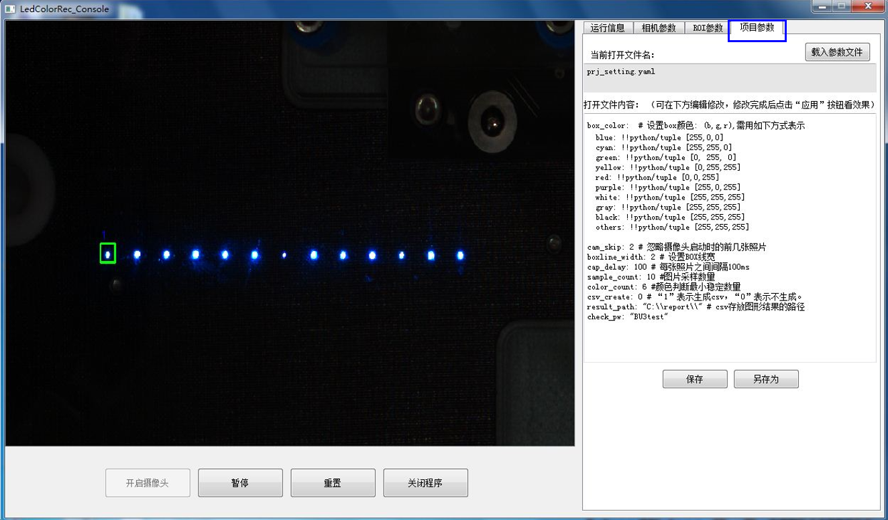

参数说明：

box\_color: 用于设定box边框颜色，比如如果box检测到”blue”，则box边框颜色取值为[255, 0, 0](就是蓝色)。

Cam\_skip: 设置需要忽略摄像头启动时拍到的前几张图片。如果设为“2”，就是忽略前2张。因为相机开启时的前几张图片可能会出现质量不佳的情况。此参数需根据实际情况进行设置。

boxline\_width: 设置box的边框线宽。

sample\_count: 设置采样图片的数量。

cap\_delay: 设置采样之间的间隔时间。比如采样数量为“10”，间隔时间为“100ms”，意思就是在1s的时间里每隔100ms采样一张图片。这样做可以避免采样时恰巧遇到灯光不稳定的瞬时异常情况。

color\_count: 设置颜色判断最小数量。比如检测目标是一个蓝色LED灯，设置此值为“6”，采样数量为“10”时，如果10次采样中有6次或以上为蓝色，则判定此灯为蓝色。如果只有5次及以下为蓝色，另外几次为其他颜色时，则不能判定此灯为蓝色。这样做可以增强测试结果的可靠度。

csv\_result: 此值设为”1”时，表示每次检测都会生产1个.csv文件的log. 设为“0”，表示不会生成.csv结果log，只会在命令行中print结果。

result\_path: 用于设置.csv文件的生成路径。

注意：修改时不可修改参数名称，只可修改冒号”:”后的数值或字符。

